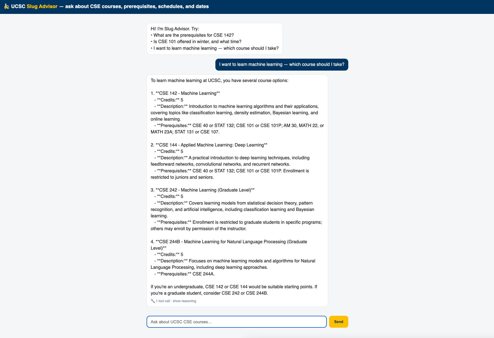
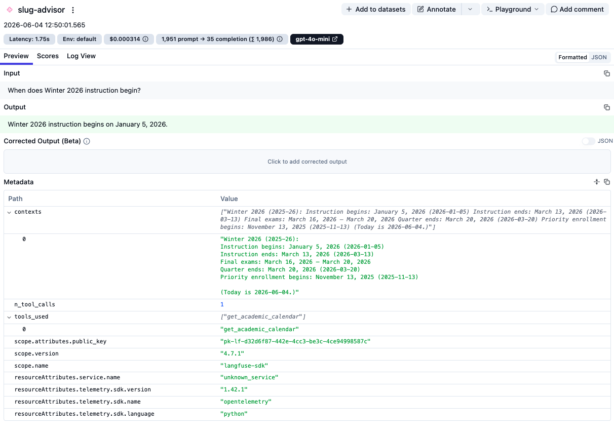
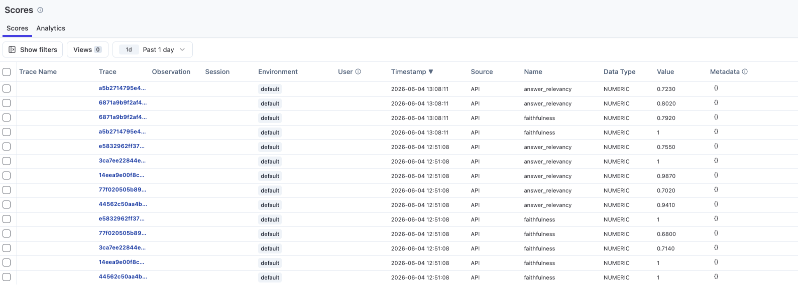

# 🍌 UCSC Slug Advisor — a tool-calling agent for course advising

A production-style **tool-calling agent** that answers UC Santa Cruz CSE students'
questions about courses, prerequisites, schedules, and academic dates — over
**real scraped catalog data**, with a layered **eval-in-CI** harness and a live demo.

### ▶︎ Live demo: **https://slug-advisor-759005971862.us-central1.run.app**

```
Q: What's the prerequisite for the machine learning course, and is it offered this fall?

A: The machine learning course is CSE 142. Its prerequisites are CSE 40 or STAT 132;
   CSE 101 or CSE 101P; AM 30/MATH 22/MATH 23A; and STAT 131 or CSE 107.
   It is offered in Fall 2025 — MWF 4:00–5:05 PM, Physical Sciences 110 (open, 69 seats left).

   🔧 search_catalog({"query": "machine learning"})
   🔧 lookup_schedule({"course_code": "CSE 142", "term": "Fall 2025"})
```

The agent **decides which tools to call** and chains them (find the course, then
look up its schedule) — the tool-call trace is shown in the UI.



---

## Architecture

```
        user question
             │
   LangGraph ReAct agent (gpt-4o-mini)      ← plans, calls tools, composes the answer
             │
   ┌─────────┼───────────────┬───────────────────┐
   ▼         ▼               ▼                   ▼
search_catalog  lookup_schedule  get_academic_calendar  web_search
(hybrid RAG)    (structured)     (structured + dates)   (fallback)
   │
 BM25 + FAISS (RRF fusion) → CrossEncoder reranker → top course passages
```

**Design principle — RAG vs tools:** unstructured text (course descriptions,
prerequisites) goes through `search_catalog` (retrieval); structured / dynamic /
computational data (offerings, dates) goes through dedicated tools. Mixing them is
the most common agent-design mistake.

## Highlights

- **Tool-calling ReAct agent** (LangGraph) with a recursion cap and graceful overflow.
- **Hybrid retrieval** — BM25 + FAISS with RRF fusion, then a CrossEncoder reranker
  (course codes like `CSE 101` need exact matching that dense vectors blur).
- **Guardrails** — anti-hallucination (escalate to web search or honestly say "not in
  the catalog" instead of fabricating) and a **capability-bound scope** rule (scope =
  what the tools can answer, so adding data = adding tools, not editing prompts).
- **Eval-in-CI** — a 5-metric suite (see below) gated in GitHub Actions.
- **Observability** — the deployed agent is traced in Langfuse (latency, token cost,
  tool usage), with an eval-score loop that grades live traces (see below).
- **MCP server** — the same tools are exposed over the Model Context Protocol
  (`mcp_server/`), so any MCP client (e.g. Claude Desktop) can call the
  catalog / schedule / calendar tools directly.
- **Data-driven restraint** — the project's earlier RL router and IRCoT were
  *deliberately not used* here: the eval showed retrieval never fails on this domain,
  so they'd have nothing to fix. Knowing when **not** to add complexity.
- **Deployed** to Cloud Run with cost/abuse controls (per-IP rate limit, daily quota
  ~ $22/month cap, input-length cap, `max-instances=1`).

## Evaluation (the part most personal projects skip)

A 69-question eval set, **self-grounded** in the real data (answers derived from the
scraped catalog, so they're correct by construction), scored on a **complementary
metric suite** — each metric catches failures the others miss:

| metric | type | catches |
|---|---|---|
| answer correctness | deterministic | wrong/missing facts |
| tool-selection accuracy | deterministic | wrong tool / failure to escalate |
| context recall | deterministic | retrieval missed the right course |
| **faithfulness** (Ragas) | LLM-judged | ungrounded fabrication |
| **answer relevancy** (Ragas) | LLM-judged | off-topic / evasive answers |

Two-layer CI (`.github/workflows/eval.yml`): **L1** deterministic unit tests on every
PR (no LLM, must pass 100%); **L2** the full agent + Ragas eval nightly, gated against
a committed baseline with per-metric drift tolerance. Capability gaps (e.g. counting,
which no tool covers yet) are tracked as non-gating `xfail`-style diagnostics.

Current baseline (69 q): answer 100 / tool-selection 100 / context-recall 100 /
faithfulness 0.93 / answer-relevancy 0.82.

## Observability (Langfuse)

The deployed agent is instrumented with **Langfuse** (`agents/observability.py`,
key-gated so it's a no-op without keys). Every run is one trace with its **latency,
token cost, model, and the tools it called** — so the live demo's real usage and cost
are visible per request.



**Eval ↔ observability loop** (`eval/score_traces.py`): an offline scorer pulls recent
production traces and grades them with the *same* reference-free Ragas metrics
(faithfulness, answer relevancy), pushing the scores back to Langfuse. Live answer
quality is monitored over time **without adding judge-call latency or cost to user
requests** (production questions have no gold labels, so the deterministic graders stay
in the offline eval set and only the reference-free metrics run online).



## Repo layout (`agent_integration/`)

```
agents/slug_advisor_agent.py   ReAct orchestrator + system prompt / guardrails
agents/slug_tools.py           lookup_schedule, get_academic_calendar, web_search
agents/slug_retrieval.py       search_catalog (hybrid retrieval + reranker)
agents/observability.py        Langfuse tracing (key-gated, no-op without keys)
agents/{hybrid_retriever,reranker}.py   reused retrieval engineering
scripts/                       scrape catalog → build data / vectorstore / eval set
data-ucsc/                     226 real CSE courses + calendar + schedule + 69-q eval
eval/                          graders, run_eval, Ragas quality, baseline gate
eval/score_traces.py           offline scorer: grade production traces → Langfuse
tests/                         L1 deterministic tests
slug_service/                  FastAPI demo + chat UI + Dockerfile / Cloud Build deploy
mcp_server/                    same tools exposed via Model Context Protocol (FastMCP)
```

## Run locally

```bash
cd agent_integration
export OPENAI_API_KEY=sk-...  EMB_MODEL=text-embedding-3-small  GEN_LLM_MODEL=gpt-4o-mini

# build the vectorstore once (FAISS index over the scraped catalog)
python scripts/build_ucsc_vectorstore.py --courses data-ucsc/cse_courses.json \
    --out vectorstore-ucsc/ucsc_cse_faiss

python -m agents.slug_advisor_agent "What are the prerequisites for CSE 142?"   # CLI
uvicorn slug_service.app:app --port 8100   # web demo → http://localhost:8100

python -m pytest tests/             # L1 deterministic tests
python -m eval.run_eval --quality   # full eval + Ragas (needs API key)
```

## Deploy

`slug_service/deploy.sh` builds on Cloud Build (native amd64) and deploys to Cloud Run
with the cost/abuse caps. See `slug_service/README.md` for the env knobs and the
fresh-container dependency-pinning gotchas (langgraph sub-packages; `numpy<2` for faiss).

---

*Built on the retrieval engineering from this repo's earlier HotpotQA agentic-RAG
pipeline (multi-hop QA, hybrid retrieval, RL routing) — reused inside `search_catalog`,
re-pointed from a benchmark to a real, deployed, student-facing use case. The original
full-stack pipeline README is preserved at [`docs/README-pipeline.md`](docs/README-pipeline.md).*
